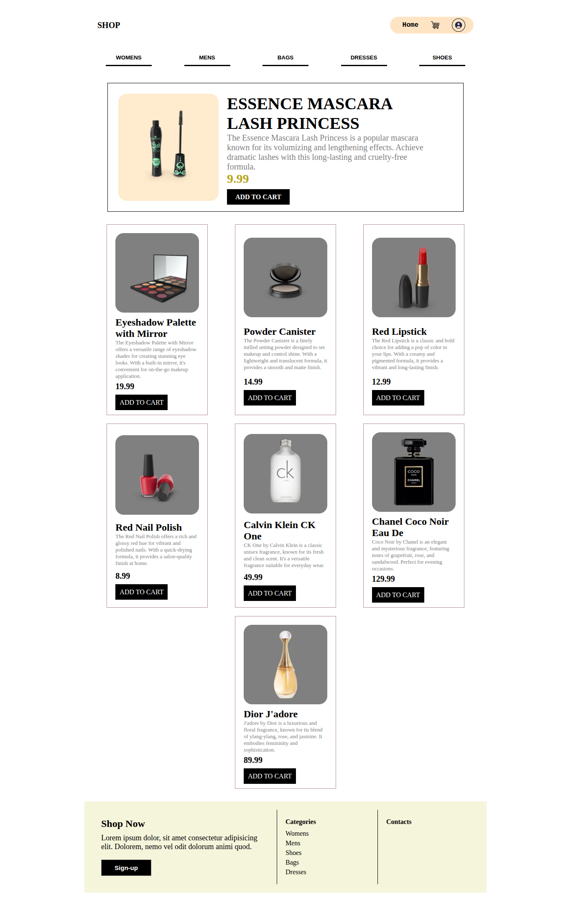
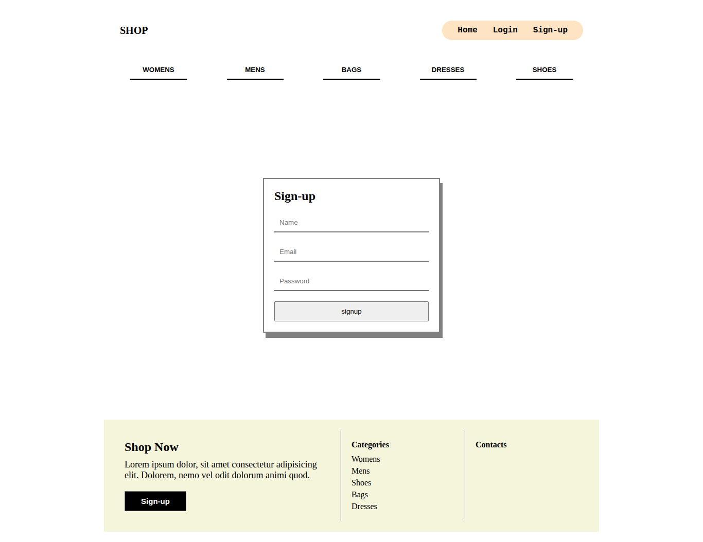
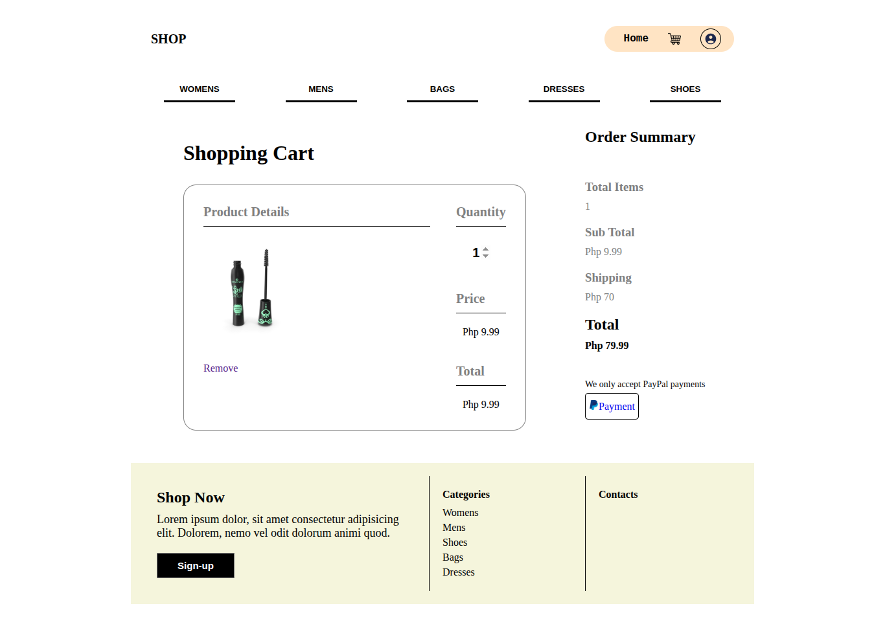

# 🧠 ONLINE SHOP

Online Shop, choose products and pay online using PayPal.

## 📝 Description

This is a Python project for my day 97, this is compose of three sub folders for the backend, admin, and client ui.

## 🖼️ Preview

  
  

  
  

